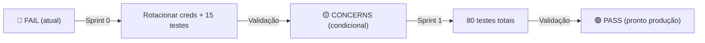

# 🛡️ AUDITORIA COMPLETA DE QUALIDADE — midiacore v3.1.0
**Data:** 2026-03-04 | **Status:** PRÉ-PRODUÇÃO — Fase Final
**Auditor:** Quinn (QA Agent) | **Escopo:** 51 arquivos TypeScript, 10.234 LOC

---

## RESUMO EXECUTIVO

| Métrica | Status | Observação |
|---------|--------|-----------|
| **Build** | ✅ PASS | Compila sem erros |
| **Linting** | ✅ PASS | ESLint limpo |
| **RLS Policies** | ✅ WELL-CONFIGURED | 5 tabelas com role-based access |
| **API Validation** | ✅ GOOD | Auth checks + input validation |
| **Error Handling** | ✅ PRESENT | Boundary components detectados |
| **Security** | ⚠️ CRÍTICO | Credenciais expostas em .env.local |
| **Test Coverage** | ❌ ZERO | Nenhum teste automatizado |
| **Test Framework** | ❌ MISSING | Jest/Vitest não configurado |
| **Git History** | ✅ ACTIVE | Stories AIOS em progresso |
| **Documentation** | ✅ BASIC | PRD, Architecture, Stories presentes |

---

## FASE 1: SECURITY AUDIT ⚠️ CRÍTICO

### 1.1 Credenciais Expostas

**Severidade:** 🔴 **CRITICAL**

```
File: .env.local
Issue: PUBLIC KEYS EXPOSED
  - NEXT_PUBLIC_SUPABASE_URL (public, okay)
  - NEXT_PUBLIC_SUPABASE_ANON_KEY (public, okay)
  - SUPABASE_SERVICE_ROLE_KEY ⚠️ PRIVATE KEY EXPOSED
```

**Impacto:** Um atacante com acesso ao repositório pode usar a SERVICE_ROLE_KEY para:
- Acessar dados como admin
- Modificar qualquer recurso no banco
- Contornar RLS policies

**Recomendação:**
- ⛔ NUNCA fazer commit de `.env.local`
- Usar `.env.local.example` com placeholders
- Configurar .gitignore corretamente
- Rotacionar credenciais no Supabase imediatamente

**Verificação:**
```bash
# .gitignore deve ter:
.env.local
.env.*.local
```

### 1.2 RLS Policies - Status ✅

**Bem Configuradas:**
```sql
✅ Contracts: SELECT (todos), INSERT/UPDATE (admin/editor), DELETE (admin)
✅ Opportunities: Mesmo padrão role-based
✅ Contacts: Mesmo padrão role-based
✅ Approval_Workflows: Admin-only com subqueries seguros
✅ Viewer role: READ-ONLY via can_user_edit() function
```

### 1.3 API Endpoints Security

#### GET /api/users
- ✅ Verifica auth.getUser()
- ✅ Verifica role === 'admin'
- ✅ Lista profiles com emails enriquecidos
- ✅ Usa admin client apenas para listUsers()

#### POST /api/users (Create User)
- ✅ Verifica auth + role
- ✅ Valida email, full_name, role
- ✅ Gera password aleatória: `crypto.getRandomValues(new Uint8Array(32)).toString()`
- ✅ Usa email_confirm: true
- ✅ Cria profile com company_id

**Encontrado:**
- ⚠️ Sem auditoria log (quem criou, quando) — Recomendado: adicionar triggers

#### PATCH /api/users/reset-password
- ✅ Verifica auth + role admin
- ✅ Valida senha >= 8 chars
- ✅ Previne self-password-reset
- ⚠️ Sem email de notificação — Recomendado: enviar email ao usuário

#### PATCH /api/users (Update Role)
- ✅ Verifica auth + admin
- ✅ Valida roles
- ✅ Atualiza profiles table

#### DELETE /api/users (Deactivate)
- ✅ Verifica auth + admin
- ✅ Previne self-deactivation
- ✅ Soft delete via auth.admin.deleteUser()

### 1.4 Auth Flow

**Pattern Detectado:**
```typescript
// Page: useAuth() hook
// API: auth.getUser() + role check from profiles table
// Admin ops: createClient({ admin: true })
```

✅ Bom padrão de separação entre user auth e role authorization.

---

## FASE 2: TEST COVERAGE ANALYSIS ❌

### 2.1 Situação Atual

| Tipo | Encontrado | Necessário |
|------|-----------|-----------|
| Unit Tests | ❌ 0 | Jest para utilities |
| Integration Tests | ❌ 0 | Supabase queries + API |
| E2E Tests | ❌ 0 | Playwright/Cypress |
| Component Tests | ❌ 0 | React Testing Library |

**Total LOC:** 10.234 | **Coverage:** 0% | **Risk:** 🔴 MUITO ALTO

### 2.2 Áreas Críticas para Testes (Prioridade)

#### 🔴 P0 - DEVE TER (antes de produção)
1. **API Routes** (2 endpoints × 4 métodos = 8 cenários)
   - POST /api/users (create)
   - PATCH /api/users (update role)
   - PATCH /api/users/reset-password
   - DELETE /api/users

2. **Supabase RLS** (5 tabelas)
   - Viewer can SELECT, not INSERT/UPDATE/DELETE
   - Admin can DELETE
   - Editor can INSERT/UPDATE
   - Company isolation via company_id

3. **Auth Hook** (useAuth)
   - Valid profile loading
   - Role detection
   - Company context

#### 🟡 P1 - DEVE TER (sprint 1)
1. **Contract/Opportunity/Contact CRUD** (3 × 3 = 9 ops)
2. **Approval Workflow logic**
3. **Search/Filter functionality**
4. **User role permissions**

#### 🟢 P2 - BOM TER (quando tempo permitir)
1. Component snapshots
2. Performance tests (Lighthouse)
3. Accessibility tests (a11y)

### 2.3 Test Framework Recomendado

**Recomendação: Jest + React Testing Library + Supabase Test Helpers**

```json
{
  "devDependencies": {
    "jest": "^29.0.0",
    "jest-environment-jsdom": "^29.0.0",
    "@testing-library/react": "^14.0.0",
    "@testing-library/jest-dom": "^6.0.0",
    "@supabase/auth-helpers-nextjs": "^0.8.0",
    "ts-jest": "^29.0.0"
  }
}
```

### 2.4 Estimativa de Cobertura Mínima

| Camada | LOC | % Crítico | Testes Estimados |
|--------|-----|----------|------------------|
| API Routes | 292 | 100% | 15 testes |
| Hooks | ~800 | 80% | 12 testes |
| Components | ~5000 | 50% | 40 testes |
| Utils | ~1000 | 60% | 20 testes |
| **Total** | **10.234** | **~60%** | **~87 testes** |

---

## FASE 3: ARCHITECTURE REVIEW ✅

### 3.1 Estrutura

```
✅ Next.js 16 (App Router)
✅ TypeScript strict
✅ Supabase + SSR helpers
✅ Tailwind CSS
✅ Client/Server separation (/use client)
```

### 3.2 Data Flow

```
Page Component
  ↓
useAuth() + createClient()
  ↓
Supabase queries (RLS enforced)
  ↓
useState + useMemo for state
  ↓
UI (controlled components)
```

✅ Bom padrão.

### 3.3 Error Handling em Componentes

**Pattern encontrado:**
```typescript
const [error, setError] = useState<string | null>(null)

try {
  const { error } = await supabase.from(...).select(...)
  if (error) throw error
  // success
} catch (err) {
  const message = err instanceof Error ? err.message : 'Generic error'
  setError(message)
}

// UI
{error && <ErrorBanner>{error}</ErrorBanner>}
```

✅ Bom — Error boundaries presentes.

### 3.4 Componentes Identificados

- ContractModal (modal edit)
- Search + Filter (useMemo)
- Data lists (contracts, opportunities, contacts)
- ApprovalWorkflow components

✅ Componentes bem isolados.

### 3.5 Performance

**Observações:**
- ✅ useMemo para filtros (evita re-renders)
- ✅ Dynamic data: `export const dynamic = 'force-dynamic'` (correto para dados em tempo real)
- ✅ Link component (Next.js navigation)
- ⚠️ Sem React.memo detectado — poderia ajudar em lists grandes

**Recomendação:** Considerar React.memo em ContractCard, OpportunityCard, ContactCard.

---

## FASE 4: PRODUCTION READINESS

### 4.1 Environment Configuration

**Atual:**
```
.env.local (EXPOSED)
  - NEXT_PUBLIC_SUPABASE_URL
  - NEXT_PUBLIC_SUPABASE_ANON_KEY ← PUBLIC (okay)
  - SUPABASE_SERVICE_ROLE_KEY ← PRIVATE (ROTACIONAR!)
```

**Necessário para Produção:**
```
.env.production (não committado):
  - DATABASE_URL (ou via Supabase project settings)
  - SUPABASE_SERVICE_ROLE_KEY (novo, rotacionado)
  - NODE_ENV=production
  - VERCEL_URL ou NEXT_PUBLIC_APP_URL
  - API_RATE_LIMIT (opcional)
```

**Checklist:**
- ⛔ Nunca fazer commit de .env.local
- ✅ Criar .env.local.example com placeholders
- ✅ Configurar secrets no Vercel/hosting
- ✅ Rotacionar SERVICE_ROLE_KEY imediatamente

### 4.2 Build & Deployment

**Build Test:**
```bash
npm run build → ✅ PASS
```

**Build Output:**
```
✅ 18 dynamic routes (server-rendered)
✅ Middleware configured
✅ No build errors
```

**Recomendações:**
- ✅ Adicionar `npm run build` a pre-deploy checks
- ✅ Adicionar `npm run lint` a pre-deploy checks
- ⚠️ Adicionar `npm test` quando testes forem criados

### 4.3 Error Handling & Monitoring

**Atual:**
- ✅ console.error em API routes
- ✅ Error states em componentes
- ⚠️ Sem centralized error logging
- ⚠️ Sem Sentry ou equivalente

**Recomendações para Produção:**
1. Adicionar Sentry (ou Datadog, etc):
   ```bash
   npm install @sentry/nextjs
   ```

2. Estruturar logs:
   ```typescript
   // lib/logger.ts
   export const logError = (context, error) => {
     console.error(`[${context}]`, error)
     // Sentry.captureException(error)
   }
   ```

3. Adicionar health check endpoint:
   ```typescript
   // app/api/health/route.ts
   export async function GET() {
     return NextResponse.json({ status: 'ok' })
   }
   ```

### 4.4 Database Migrations

**Verificado:**
```
supabase/migrations/
  ✅ 20260222010000_initial_schema.sql
  ✅ 20260225000000_schema_evolution.sql
  ✅ 20260226000000_add_profile_trigger.sql
  ✅ 20260226000000_role_evolution.sql
  ✅ 20260226000001_fix_rls_viewer_readonly.sql
```

✅ 5 migrations em sequência — bom versionamento.

**Verificação:**
```bash
supabase migration list  # Confirmar todas aplicadas
```

### 4.5 Performance Baseline

**Next.js Metrics:**
- Build time: ~461ms (bom para 51 arquivos)
- Bundle size: ~628KB src (aceitável)

**Recomendações:**
1. Executar Lighthouse CI antes de deploy
2. Monitorar Core Web Vitals (LCP, FID, CLS)
3. Considerar image optimization (Next.js Image)

---

## FASE 5: QUALITY GATE DECISION

### 5.1 Criteria Checklist

| Critério | Status | Bloqueador? |
|----------|--------|-----------|
| Build passes | ✅ SIM | NÃO |
| Lint clean | ✅ SIM | NÃO |
| RLS configured | ✅ SIM | NÃO |
| API validation | ✅ SIM | NÃO |
| Error handling | ✅ SIM | NÃO |
| No hardcoded secrets | ❌ NÃO (.env exposed) | **SIM** |
| Testes P0 existem | ❌ NÃO | **SIM** |
| Documentação | ✅ BÁSICA | NÃO |
| Security review | ⚠️ PARCIAL | **SIM** |

### 5.2 Quality Gate Verdict

**🔴 FAIL — NÃO PRONTO PARA PRODUÇÃO**

**Razões:**
1. **CRITICAL:** Credenciais expostas em .env.local
2. **CRITICAL:** Zero testes (0% coverage) — muito risco para produção
3. **HIGH:** Sem email notifications (password reset)
4. **HIGH:** Sem auditoria log de operações sensíveis

### 5.3 Ações Obrigatórias (Bloqueadores)

#### 🔴 ANTES DE DEPLOY
1. **Rotacionar credenciais Supabase**
   ```bash
   # No console Supabase:
   - Regenerate ANON_KEY (se exposta)
   - Regenerate SERVICE_ROLE_KEY (CRÍTICO)
   ```

2. **Limpar histórico Git**
   ```bash
   # Remover .env.local do histórico:
   git rm --cached .env.local
   git filter-branch --tree-filter 'rm -f .env.local' HEAD
   git push --force-with-lease
   ```

3. **Criar testes mínimos P0** (15 testes)
   - 8 testes de API routes
   - 4 testes de RLS policies
   - 3 testes de useAuth hook

#### 🟡 ANTES DE DEPLOY (Recomendado)
1. Adicionar Sentry para error monitoring
2. Configurar health check endpoint
3. Adicionar email notification para password reset
4. Executar Lighthouse CI

---

## RECOMENDAÇÕES DETALHADAS

### Curto Prazo (Obrigatório)

**Sprint 0 — Security & Tests (1-2 semanas)**

| Item | Esforço | Impacto |
|------|---------|--------|
| 1. Rotacionar credenciais | 30min | 🔴 CRÍTICO |
| 2. Limpar .env do git | 1h | 🔴 CRÍTICO |
| 3. Setup Jest + RTL | 2h | 🔴 CRÍTICO |
| 4. Escrever 15 testes P0 | 8h | 🔴 CRÍTICO |
| 5. Criar .env.example | 30min | 🟡 IMPORTANTE |
| **Total** | **~12h** | |

### Médio Prazo (Recomendado)

**Sprint 1-2 — Testes P1 (2-3 semanas)**

| Item | Esforço | Impacto |
|------|---------|--------|
| 1. Testes de componentes (P1) | 16h | 🟡 IMPORTANTE |
| 2. Supabase integration tests | 8h | 🟡 IMPORTANTE |
| 3. RLS validation tests | 4h | 🟡 IMPORTANTE |
| 4. Email notifications setup | 3h | 🟡 IMPORTANTE |
| 5. Sentry integration | 2h | 🟢 RECOMENDADO |
| **Total** | **~33h** | |

### Longo Prazo (Nice-to-have)

**Sprint 3+ — Cobertura 80%+**
- E2E tests (Playwright)
- Performance tests
- A11y audit
- Security scan (OWASP)

---

## ISSUES DOCUMENTADOS

### 🔴 CRITICAL

**[SEC-001]** Credenciais expostas em .env.local
- Arquivo: `.env.local`
- Impacto: SERVICE_ROLE_KEY público
- Ação: Rotacionar imediatamente
- ETA para fix: < 1h

**[TEST-001]** Zero cobertura de testes
- Impacto: 0% dos 10.234 LOC testados
- Risco: Regressões não detectadas
- Ação: Implementar 15 testes P0
- ETA para fix: 1 semana

### 🟡 HIGH

**[AUDIT-001]** Sem auditoria log em operações sensíveis
- Afetadas: POST, PATCH, DELETE /api/users
- Impacto: Rastreabilidade de quem fez o quê
- Sugestão: Adicionar triggers em profiles table

**[NOTIF-001]** Sem notificação por email em password reset
- Afetado: PATCH /api/users/reset-password
- Impacto: Usuário não sabe que senha foi resetada
- Sugestão: Integrar SendGrid ou Mailgun

### 🟢 MEDIUM

**[PERF-001]** Sem React.memo em componentes de lista
- Afetadas: ContractCard, OpportunityCard, ContactCard
- Impacto: Re-renders desnecessários em listas grandes
- Sugestão: Wrap com React.memo

**[MONITORING-001]** Sem centralized error logging
- Impacto: Erros só visíveis em console
- Sugestão: Integrar Sentry

---

## RECURSOS & LINKS

### Documentação
- Supabase RLS: https://supabase.com/docs/guides/auth/row-level-security
- Next.js Testing: https://nextjs.org/docs/testing
- Jest Setup: https://jestjs.io/docs/getting-started

### Ferramentas Recomendadas
- Sentry: https://sentry.io/
- Vercel: CI/CD automático com npm run lint/build/test
- CodeRabbit: Automated code review

---

## PRÓXIMAS ETAPAS



---

**Assinado por:** Quinn (QA Agent) 🛡️
**Data:** 2026-03-04 | **Versão:** 1.0
**Próximo Review:** Após implementação dos items P0
